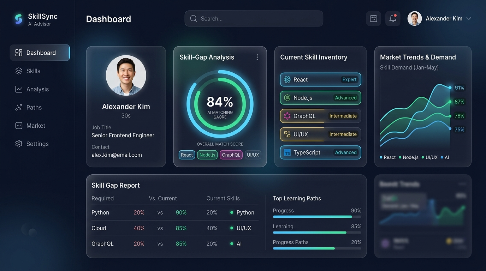

# 🎯 Smart Job Market & Skill-Gap Advisor

[](https://www.oracle.com/java/)
[](https://spring.io/projects/spring-boot)
[](https://react.dev/)
[](https://vitejs.dev/)
[](https://tailwindcss.com/)
[](https://www.mysql.com/)
[](https://www.docker.com/)
[](http://localhost:8080/swagger-ui.html)
[](LICENSE)

An enterprise-grade, production-ready full-stack AI platform designed to compare candidate skill profiles against real-time recruitment market demands, calculate job readiness percentages, pinpoint missing technical and soft skills, and deliver personalized learning roadmaps.

---

## 📸 Platform Interface



---

## ✨ Key Features

- **💡 Weighted Skill Gap Engine**: Evaluates candidate skill vectors against target job roles, differentiating core critical requirements from secondary nice-to-haves.
- **📊 Real-Time Market Intelligence**: Interactive data visualizations powered by Recharts, displaying top trending skills, industry hiring metrics, and salary benchmarks.
- **🔐 JWT Authentication & RBAC Security**: Multi-tier role-based access control supporting `ROLE_USER`, `ROLE_MANAGER`, and `ROLE_ADMIN` with encrypted session management.
- **🎓 Personalized Upskilling Recommendations**: Maps identified skill gaps directly to top-rated courses, certifications, and step-by-step career roadmaps.
- **🎨 Glassmorphism Modern UI**: Premium responsive UI built with React 18, Tailwind CSS, Lucide icons, Framer Motion, and fluid Light/Dark mode toggles.
- **📑 OpenAPI & Swagger Documentation**: Complete interactive API sandbox and testing interface available at `/swagger-ui.html`.
- **🐳 Full Containerization**: Pre-configured multi-container orchestration with Docker and Docker Compose.

---

## 🏗️ System Architecture

```mermaid
graph TD
    User([👤 Candidate / Manager]) -->|HTTPS / REST| UI[📱 React 18 Single Page App]
    UI -->|JWT Auth Header| Gateway[🌐 Spring Security JWT Filter]
    Gateway --> Ctrl[🎮 REST Controllers]
    Ctrl --> Engine[⚡ Skill Gap Engine & Business Services]
    Engine --> JPA[💾 Spring Data JPA Repositories]
    JPA --> DB[(🗄️ MySQL 8.0 Database)]
    
    subgraph Containerized Stack (Docker Compose)
        UI
        Gateway
        Ctrl
        Engine
        JPA
        DB
    end
```

---

## 🛠️ Technology Stack

| Layer | Technologies & Tools |
| :--- | :--- |
| **Frontend** | React 18, Vite 5, Tailwind CSS, Lucide Icons, Recharts, Framer Motion, Axios |
| **Backend** | Java 21 LTS, Spring Boot 3.2.3, Spring Security, Spring Data JPA, Lombok |
| **Security** | JSON Web Tokens (JWT HMAC SHA-512), BCrypt Password Hashing |
| **Database** | MySQL 8.0 (Relational schema with automated indexing and foreign keys) |
| **API Docs** | Swagger UI / OpenAPI 3.0 (`/swagger-ui.html`) |
| **DevOps** | Docker, Docker Compose, Nginx |

---

## 📁 Repository Structure

```text
smart-job-market-skillgap-advisor/
├── backend/                  # Spring Boot 3.2 Java 21 REST API
│   ├── src/                  # Source code (Controllers, Services, Repos, Entities, Security)
│   └── pom.xml               # Maven configuration & dependencies
├── frontend/                 # React 18 + Vite + Tailwind CSS Single Page Application
│   ├── src/                  # Components, Pages, Contexts, Services, Styles
│   ├── package.json          # Frontend dependencies
│   └── vite.config.js        # Vite build & proxy settings
├── database/                 # Database scripts & ER diagrams
│   ├── schema.sql            # Table definitions & constraints
│   ├── seed.sql              # Initial market data & sample job postings
│   └── er_diagram_description.md
├── docker/                   # Containerization configs
│   ├── Dockerfile.backend    # Spring Boot container image spec
│   ├── Dockerfile.frontend   # React Nginx container image spec
│   └── docker-compose.yml    # Multi-container stack compose file
├── docs/                     # Comprehensive documentation suite
│   ├── architecture.md       # System design & calculation algorithm
│   ├── api_documentation.md  # API endpoints specification
│   ├── installation_guide.md # Step-by-step setup guide
│   ├── user_manual.md        # User workflow guide
│   ├── admin_manual.md       # Admin management guide
│   ├── deployment_guide.md   # Deployment instructions
│   └── troubleshooting.md    # Common issues & resolutions
├── skillgap_advisor_ui_mockup_1786635690011.jpg # UI Preview Image
├── .gitignore                # Git exclusion rules
├── LICENSE                   # Apache 2.0 Open Source License
└── README.md                 # Project README
```

---

## 🚀 Quick Start Guide

### Prerequisites

Ensure you have the following installed on your machine:
- **Java JDK 21** or higher
- **Node.js** (v18.x or later) & `npm`
- **MySQL Server 8.0** running on `localhost:3306` (or Docker installed)

---

### Option 1: Run with Docker Compose (Recommended)

To launch the complete stack (Database, Backend, and Frontend) with a single command:

```bash
cd docker
docker-compose up --build
```
- **Frontend App**: `http://localhost:80` (or `http://localhost:5173` if running local Vite)
- **Backend API**: `http://localhost:8080`
- **Swagger UI**: `http://localhost:8080/swagger-ui.html`

---

### Option 2: Manual Local Setup

#### 1. Database Setup
Initialize the database in MySQL:
```bash
mysql -u root -p < database/schema.sql
mysql -u root -p < database/seed.sql
```

#### 2. Backend Execution (Spring Boot)
```bash
cd backend
./mvnw spring-boot:run
```
*The Spring Boot server will launch on `http://localhost:8080`.*

#### 3. Frontend Execution (React + Vite)
```bash
cd frontend
npm install
npm run dev
```
*The React frontend app will be accessible at `http://localhost:5173`.*

---

## 🔑 Default Credentials

The platform comes pre-seeded with sample user accounts for testing:

| User Role | Username / Email | Password | Access Level |
| :--- | :--- | :--- | :--- |
| **Candidate** | `user@skillgap.com` | `Password123!` | Standard Candidate Profile & Skill Gap Analysis |
| **Manager** | `manager@skillgap.com` | `Password123!` | Job posting creation & market trends update |
| **Administrator** | `admin@skillgap.com` | `AdminPass123!` | System configuration & full administrative privileges |

---

## 🌐 API Endpoints Summary

All backend API routes are prefixed under `/api/v1`. Below is an overview:

| Endpoint | Method | Access | Description |
| :--- | :--- | :--- | :--- |
| `/auth/register` | `POST` | Public | Register a new user account |
| `/auth/login` | `POST` | Public | Authenticate user & return JWT token |
| `/users/profile` | `GET` / `PUT` | Authenticated | Manage candidate profile and target job role |
| `/users/skills` | `POST` / `DELETE`| Authenticated | Manage candidate skill inventory |
| `/jobs` | `GET` | Public | Fetch paginated job listings & required skills |
| `/advisor/analyze` | `POST` | Authenticated | Trigger AI Skill-Gap Analysis engine |
| `/analytics/trends` | `GET` | Public | Get market trends & high-demand skill metrics |
| `/courses` | `GET` | Public | Browse recommended learning resources |

*For complete request/response schemas, visit the live **Swagger UI** at `http://localhost:8080/swagger-ui.html`.*

---

## 📘 Complete Documentation Suite

For detailed guides, refer to the documentation in the [`docs/`](./docs) directory:

- 📖 [**Installation Guide**](./docs/installation_guide.md)
- 📐 [**System Architecture & Algorithms**](./docs/architecture.md)
- 🔌 [**API Specification & Endpoints**](./docs/api_documentation.md)
- 👤 [**Candidate User Manual**](./docs/user_manual.md)
- 🛠️ [**Admin & Manager Manual**](./docs/admin_manual.md)
- 🚀 [**Deployment Guide**](./docs/deployment_guide.md)
- 🔧 [**Troubleshooting & FAQ**](./docs/troubleshooting.md)

---

## 📄 License

This project is licensed under the **Apache License 2.0** - see the [LICENSE](LICENSE) file for details.

---

## 👤 Author

**Omkar Kakumanu**
- GitHub: [@omkar-kakumanu](https://github.com/omkar-kakumanu)
- Repository: [smart-job-market-skillgap-advisor](https://github.com/omkar-kakumanu/smart-job-market-skillgap-advisor.git)
