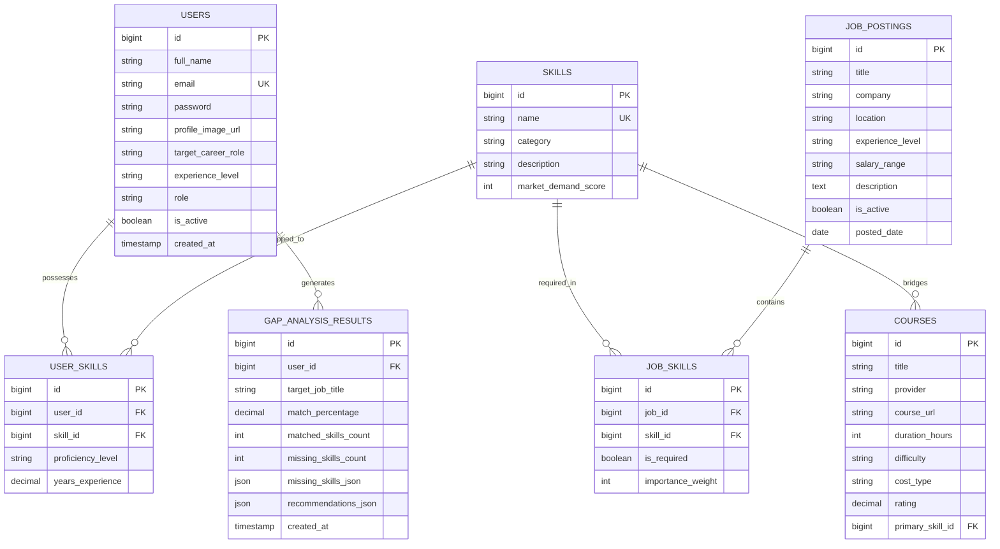

# Smart Job Market Skill-Gap Advisor - Entity Relationship Diagram & Architecture

This document provides a detailed description of the Database Schema, Entity Relationships, Constraints, and Business Rules implemented in MySQL for the platform.

## Entity Details & Keys

### 1. `users`
- **Primary Key**: `id` (AUTO_INCREMENT)
- **Unique Constraint**: `email`
- **Indexes**: `idx_user_email`, `idx_user_role`
- **Role Enums**: `ROLE_USER`, `ROLE_ADMIN`, `ROLE_MANAGER`

### 2. `skills`
- **Primary Key**: `id` (AUTO_INCREMENT)
- **Unique Constraint**: `name`
- **Categories**: `TECHNICAL`, `SOFT`, `CERTIFICATION`, `METHODOLOGY`

### 3. `user_skills`
- **Primary Key**: `id` (AUTO_INCREMENT)
- **Foreign Keys**: `user_id` -> `users(id)`, `skill_id` -> `skills(id)`
- **Unique Key**: `uq_user_skill` (`user_id`, `skill_id`)
- **Proficiency Levels**: `BEGINNER`, `INTERMEDIATE`, `ADVANCED`, `EXPERT`

### 4. `job_postings`
- **Primary Key**: `id` (AUTO_INCREMENT)
- **Indexes**: `idx_job_title`, `idx_job_company`, `idx_job_experience`

### 5. `job_skills`
- **Primary Key**: `id` (AUTO_INCREMENT)
- **Foreign Keys**: `job_id` -> `job_postings(id)`, `skill_id` -> `skills(id)`
- **Unique Key**: `uq_job_skill` (`job_id`, `skill_id`)

### 6. `courses`
- **Primary Key**: `id` (AUTO_INCREMENT)
- **Foreign Key**: `primary_skill_id` -> `skills(id)`

### 7. `gap_analysis_results`
- **Primary Key**: `id` (AUTO_INCREMENT)
- **Foreign Key**: `user_id` -> `users(id)`
- **JSON Payload Fields**: Stores structured snapshots of missing skills and course recommendations for fast historical lookups and trends.
