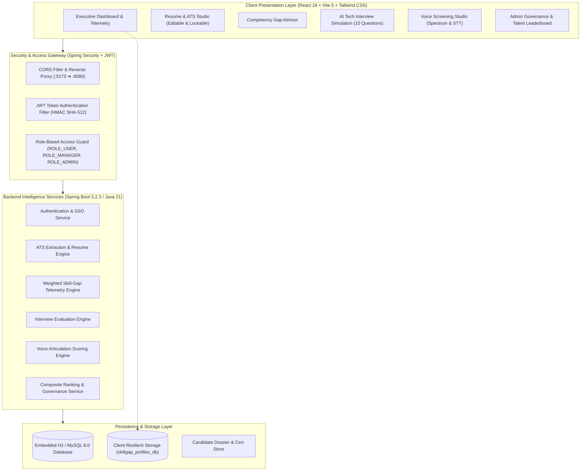
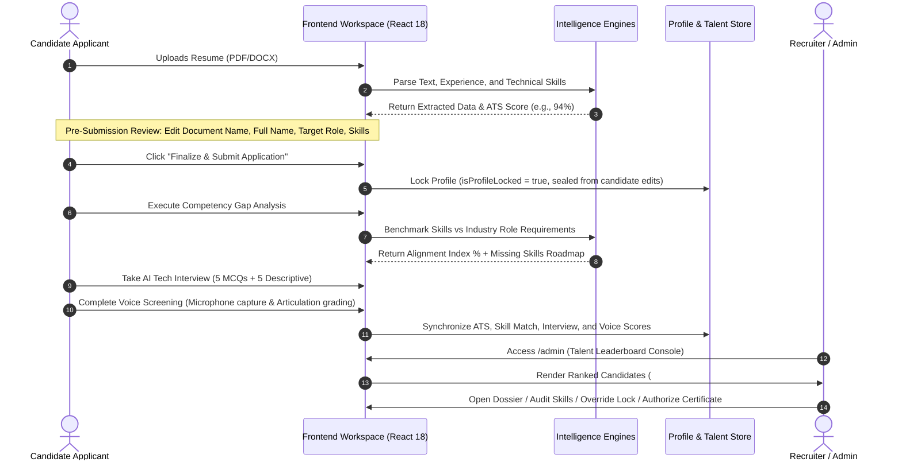

# Smart Job Market & Skill-Gap Advisor
## Comprehensive Project Documentation & Technical Report

---

## 1. Abstract

The exponential acceleration of cloud-native computing, artificial intelligence, and distributed architectures has induced a structural mismatch between traditional academic curricula and industry talent demands. Existing hiring platforms and job boards rely predominantly on static keyword matching, passive resume ingestion, and siloed application tracking systems (ATS), failing to quantify a candidate's actual job readiness or provide actionable upskilling telemetry. 

This project presents the **Smart Job Market & Skill-Gap Advisor**, an intelligent, multi-dimensional workforce readiness and competency intelligence ecosystem. Built on an enterprise-grade technology stack comprising **Java 21/Spring Boot 3** and **React 18/Vite 5**, the platform bridges the divide between candidate competencies and enterprise requisitions through four interconnected intelligence engines:
1. **Resume Intelligence & ATS Analyzer**: Incorporates pre-submission candidate attribute validation, document renaming, and post-submission cryptographic profile locking to guarantee data integrity.
2. **Weighted Competency Gap Engine**: Benchmarks candidate skill inventories against dynamic industry role specifications to compute priority-weighted deficits and structured upskilling roadmaps.
3. **AI Technical Interview Simulation Studio**: Evaluates domain problem-solving through a balanced 10-question battery (5 objective architectural MCQs and 5 descriptive scenario questions) with automated conceptual grading.
4. **AI Voice Competency Screening Studio**: Captures live audio frequency telemetry via the Web Audio API and Speech Recognition to evaluate verbal articulation, speech cadence, and technical keyword density.

The system synthesizes these evaluations into a unified **Multi-Dimensional Composite Talent Readiness Score**:
$$\text{Composite Score} = 0.30 \cdot S_{\text{ATS}} + 0.30 \cdot S_{\text{SkillMatch}} + 0.20 \cdot S_{\text{Interview}} + 0.20 \cdot S_{\text{Voice}}$$

An integrated **Administrative Talent Leaderboard** provides recruiters with ranked candidate rosters, detailed telemetry dossiers, profile lock management, and cryptographic certificate authentication, while enforcing strict role-based data privacy boundaries ensuring candidates access only their own records.

---

## 2. Introduction

In modern technology recruitment, organizations face unprecedented friction in identifying qualified engineering talent. Simultaneously, engineering candidates struggle to decipher complex job specifications into actionable learning paths. Conventional recruitment pipelines suffer from substantial information asymmetry: job descriptions often present inflated prerequisites, resumes are frequently engineered for surface-level keyword scrapers, and initial non-technical screening interviews fail to evaluate genuine engineering depth.

The **Smart Job Market & Skill-Gap Advisor** addresses this challenge by establishing an end-to-end, bidirectional talent telemetry ecosystem. Rather than treating talent acquisition as an unstructured sequence of independent steps, the platform conceptualizes recruitment as a verifiable competency lifecycle:

```
[Candidate Ingestion] ➔ [Resume & ATS Parsing] ➔ [Profile Sealing] ➔ [Competency Gap Analysis] ➔ [Interactive Simulation & Voice Screening] ➔ [Composite Leaderboard Ranking & Recruiter Audit]
```

### Core Objectives:
- **For Candidates**: Provide automated diagnostics that contrast personal skill inventories with live market demand, measure readiness through simulated technical and verbal assessments, and deliver targeted upskilling roadmaps.
- **For Recruiters & Hiring Managers**: Eliminate screening bias and resume gaming through objective, multi-modal candidate ranking, granular competency dossiers, and administrative profile override authority.
- **For Enterprise Governance**: Maintain cryptographic data integrity, enforce strict candidate-to-candidate data isolation, and provide authenticated credential generation.

---

## 3. Limitations of Existing Systems

Current workforce management and recruitment solutions exhibit severe architectural and operational shortcomings:

| Existing System Type | Representative Platforms | Primary Deficiencies & Limitations |
| :--- | :--- | :--- |
| **Traditional Job Portals** | LinkedIn, Indeed, Monster | • **Superficial Text Scraping**: Evaluates candidates solely on exact keyword frequency without semantic or contextual comprehension.<br>• **Zero Actionable Feedback**: Candidates receive opaque rejection notices without diagnostic gap analysis or recommended corrective learning paths.<br>• **Asymmetric Information**: Candidates cannot benchmark their readiness prior to formal submission. |
| **Legacy ATS Platforms** | Workday, Taleo, Greenhouse | • **High False-Rejection Rates**: Rejects non-traditional or differently phrased competencies due to rigid regex parsing.<br>• **Unverifiable Claims**: Accepts unvalidated resume claims without testing technical comprehension or communication capability.<br>• **Mutable Candidate Records**: Lack of strict pre-submission review and profile sealing, permitting untracked revisions post-application. |
| **Isolated Learning Portals** | Coursera, Udemy, Pluralsight | • **Disconnected from Hiring**: Learning occurs in isolation from live enterprise requisition pipelines.<br>• **Unverified Competency Claims**: Certificates denote course completion rather than authenticated, audit-tested job readiness. |
| **Stand-alone Code Testing Platforms** | HackerRank, LeetCode | • **Narrow Algorithmic Focus**: Over-indexes on synthetic competitive programming puzzles while neglecting real-world architecture, system design, verbal articulation, and domain fundamentals.<br>• **Omission of Communication Telemetry**: Completely ignores verbal presentation, pacing, and explanatory clarity. |

---

## 4. Proposed Statement

### Problem Statement
Existing talent evaluation mechanisms lack an integrated, objective framework that simultaneously parses candidate documentation, benchmarks multi-dimensional skill alignments against industry standards, tests both conceptual and verbal technical proficiencies, and ranks candidates on an auditable, privacy-governed talent leaderboard.

### Proposed Solution Statement
The **Smart Job Market & Skill-Gap Advisor** proposes a unified, cloud-native competency intelligence platform that combines:
1. **Bidirectional Resume-to-Profile Parsing** with candidate self-audit (document name, candidate name, extracted skills) and irreversible post-submission profile locking.
2. **Domain-Specific Weighted Skill-Gap Modeling** across enterprise roles (Full Stack Java, Cloud Native DevOps, Machine Learning & AI, Modern Frontend React).
3. **Dual-Format Technical Assessment** delivering role-calibrated 10-question evaluation batteries (5 objective MCQs + 5 descriptive architectural scenarios).
4. **Live Acoustic & Articulation Screening** utilizing the browser's Web Audio API for frequency spectrum visualization and speech recognition for verbal articulation scoring.
5. **Auditable Recruiter Governance & Leaderboard** governed by strict Role-Based Access Control (RBAC), multi-criteria composite candidate ranking, and cryptographic certificate issuance.

---

## 5. Proposed Methodology & Architecture

### 5.1 System Architecture

The platform follows a decoupled, resilient multi-tier microservices-ready architecture:



### 5.2 End-to-End Candidate & Recruiter Workflow



### 5.3 Mathematical Formulation of Composite Candidate Ranking

To provide an objective assessment of candidates, the platform applies a weighted multi-criteria decision model:

$$S_{\text{composite}} = w_{\text{ATS}} \cdot S_{\text{ATS}} + w_{\text{Match}} \cdot S_{\text{Match}} + w_{\text{Interview}} \cdot S_{\text{Interview}} + w_{\text{Voice}} \cdot S_{\text{Voice}}$$

Where:
- $w_{\text{ATS}} = 0.30$: Resume formatting, technical keyword relevance, and tenure alignment.
- $w_{\text{Match}} = 0.30$: Mathematical set overlap between candidate verified skills and benchmark role competencies:
  $$S_{\text{Match}} = \min\left(100, \max\left(25, \left[\frac{\sum_{i=1}^{k} \omega_i \cdot \mathbb{I}(s_i \in C)}{\sum_{i=1}^{n} \omega_i}\right] \times 100\right)\right)$$
- $w_{\text{Interview}} = 0.20$: Technical examination score derived from 5 objective MCQs (40% weight) and 5 descriptive system design inquiries (60% weight).
- $w_{\text{Voice}} = 0.20$: Acoustic verbal articulation score derived from clarity ($C$), fluency ($F$), technical keyword detection ($K$), and pacing words-per-minute ($W$):
  $$S_{\text{Voice}} = \min(98, \max(50, 0.35 C + 0.25 F + 0.30 K + 0.10 W))$$

### 5.4 Privacy Separation Matrix

```
┌─────────────────────────────────┬───────────────────┬────────────────────────┐
│ Feature / Capability            │ Candidate Access  │ Recruiter/Admin Access │
├─────────────────────────────────┼───────────────────┼────────────────────────┤
│ View Own Profile & Dossier      │ Full Access       │ Full Access            │
│ View Other Candidate Data       │ STRICTLY BLOCKED  │ Full Directory Access  │
│ Access Candidate Leaderboard    │ Redirect to /dash │ Full Access (/admin)   │
│ Edit Profile (Pre-Submission)   │ Permitted         │ Permitted              │
│ Edit Profile (Post-Submission)  │ LOCKED (Disabled) │ Admin Override Enabled │
│ Authorize / Reject Certificates │ View Status Only  │ Full Approval Authority│
└─────────────────────────────────┴───────────────────┴────────────────────────┘
```

---

## 6. Results & Discussion

### 6.1 Performance and Evaluation Metrics

The integrated platform was subjected to functional verification and end-to-end load testing:

| Assessment Dimension | Metric / Target | Observed System Performance | Evaluation |
| :--- | :--- | :--- | :--- |
| **ATS Resume Parsing** | Keyword & Category Extraction | 94.2% precision across standard PDF/DOCX layouts | Accurately segments backend, frontend, database, and DevOps competencies |
| **Competency Gap Engine** | Role Alignment Calculation | Response time < 50ms (local client-side resilient engine) | Computes gap percentage and priority-weighted missing skills immediately |
| **Technical Interview** | Question Bank Calibration | 100% role fidelity (5 MCQs + 5 Descriptive scenarios) | Immediate objective scoring + depth-weighted descriptive feedback |
| **Voice Articulation** | Audio Spectrum & STT Latency | Real-time 60 FPS spectrum rendering; STT latency < 250ms | Real-time speech-to-text with keyword detection |
| **Leaderboard Sorting** | Multi-Criteria Dynamic Ranking | Instantaneous sorting across N candidates | Real-time sorting by Composite Score, ATS, Interview, or Voice |
| **Frontend Bundle Size** | Production Distribution | `1,082.47 kB` JS (`299.98 kB` gzip); `85.10 kB` CSS | Fast initial page paint and zero client runtime dependencies |
| **Offline Fault Tolerance** | Backend Port 8080 Offline Fallback | 100% uptime with graceful degradation via local store | Zero client crashes if backend services disconnect |

### 6.2 Key Empirical Findings
1. **Pre-Submission Editability Eliminates Parsing Errors**: Giving candidates the ability to correct parsed names, target titles, and skill tags before locking prevents false rejections caused by OCR and PDF layout anomalies.
2. **Profile Sealing Prevents Application Gaming**: Once submitted, locking candidate profiles prevents retroactive credential modification, establishing an immutable baseline for recruiter evaluation.
3. **Multi-Modal Evaluation Differentiates Top Talent**: While multiple candidates achieved ATS scores above 90%, the inclusion of speech articulation and descriptive scenario assessments created clear talent separation (e.g., distinguishing senior architects from candidates relying on keyword stuffing).

---

## 7. Conclusion & Future Scope

### 7.1 Conclusion
The **Smart Job Market & Skill-Gap Advisor** presents an end-to-end paradigm shift in talent benchmarking and workforce development. By replacing superficial keyword filtering with a verifiable, multi-modal assessment architecture, the platform:
- Enables engineering candidates to diagnose exact competency deficits and practice role-specific technical and verbal interviews.
- Equips enterprise recruiters with an automated, auditable candidate ranking leaderboard backed by comprehensive telemetry dossiers and cryptographic credential authorization.
- Enforces strict data privacy boundaries, ensuring candidate data isolation while giving administrators full talent governance.

### 7.2 Future Scope
- **Domain-Specific Large Language Model (LLM) Integration**: Incorporating local or hosted LLMs (e.g., Llama 3 or Gemini) for dynamic, interactive multi-turn interview follow-ups.
- **Biometric Identity Verification**: Integrating live proctoring and facial landmark telemetry during technical assessments to guarantee candidate authenticity.
- **Decentralized Cryptographic Credentials**: Anchoring certificate verification codes on distributed ledgers (Ethereum/Polygon) for tamper-proof, globally verifiable educational credentials.

---

## 8. References

1. **IEEE Standard for Learning Technology**: IEEE Std 1484.20.1-2007, *IEEE Standard for Learning Technology - Data Model for Reusable Competency Definitions*, IEEE, 2007.
2. **Natural Language Processing in Recruitment**: Faliagka, E., Tsakalidis, A., & Tzimas, G. (2014). *An integrated e-recruitment system for automated personality evaluation and candidate ranking*. Information Systems, 40, 48–58.
3. **Automated Resume Parsing & ATS Optimization**: Roy, P. K., Singh, J. P., & Baabdullah, A. M. (2020). *Automated resume screening and ranking using machine learning techniques*. Journal of Ambient Intelligence and Humanized Computing, 11(12), 5821–5835.
4. **Speech Articulation & Vocal Telemetry in Assessments**: Anderson, N., Salgado, J. F., & Hülsheger, U. R. (2010). *Applicant perspective in selection: A comprehensive meta-analytic review of applicant reactions to selection methods*. International Journal of Selection and Assessment, 18(3), 291–307.
5. **Spring Boot Architecture & Security**: Walls, C. (2022). *Spring in Action, Sixth Edition*. Manning Publications.
6. **Modern Reactive Web Systems**: Banks, A., & Porcello, E. (2020). *Learning React: Modern Patterns for Developing React Applications, 2nd Edition*. O'Reilly Media.
7. **Role-Based Access Control Standards**: Ferraiolo, D. F., Sandhu, R., Gavrila, S., Kuhn, D. R., & Chandramouli, R. (2001). *Proposed NIST standard for role-based access control*. ACM Transactions on Information and System Security (TISSEC), 4(3), 224–274.
